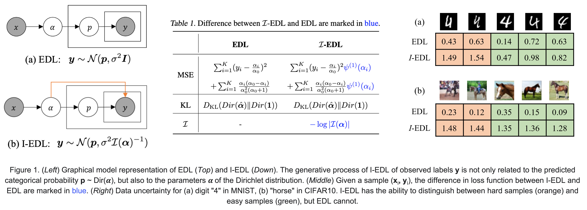

# Uncertainty Estimation by Fisher Information-based Evidential Deep Learning

[](https://arxiv.org/pdf/2303.02045.pdf)
[](https://github.com/danruod/IEDL)

> **Authors**: Danruo Deng, [Guangyong Chen](https://guangyongchen.github.io/), Yu Yang, Furui Liu, [Pheng-Ann Heng](http://www.cse.cuhk.edu.hk/~pheng/1.html)  
 **Affiliations**: CUHK, Zhejiang Lab

Uncertainty estimation is a key factor that makes deep learning reliable in practical applications. Recently proposed evidential neural networks explicitly account for different uncertainties by treating the network's outputs as evidence to parameterize the Dirichlet distribution, and achieve impressive performance in uncertainty estimation. However, for high data uncertainty samples but annotated with the one-hot label, the evidence-learning process for those mislabeled classes is over-penalized and remains hindered. To address this problem, we propose a novel and simple method, _**Fisher Information-based Evidential Deep Learning**_ ($\mathcal{I}$-EDL). In particular, we introduce Fisher Information Matrix (FIM) to measure the informativeness of evidence carried by each sample, according to which we can dynamically reweight the objective loss terms to make the network more focused on the representation learning of uncertain classes. The generalization ability of our network is further improved by optimizing the PAC-Bayesian bound. As demonstrated empirically, our proposed method consistently outperforms traditional EDL-related algorithms in multiple uncertainty estimation tasks, especially in the more challenging few-shot classification settings. 



# 🔥 Updates
- 2023.04: The source code is now available!
- 2023.04: We are delight to announce that this paper is accepted by ICML 2023!


# 🛠️ Requirement

  ```
  git clone --recursive https://github.com/danruod/IEDL.git
  conda env create -f environment.yml
  conda activate IEDL
  ```


# 🚀 File Structure & Quick-starter code

  This repository mainly contains two folders:
  * [`code_classical`](./code_classical) directory contains the experimnets on MNIST and CIFAR10.
    ```
    cd IEDL/code_classical
    python main.py --configid "1_mnist/mnist-iedl" --suffix test
    ```
    * run the configuration specifed at [`./code_classical/configs/1_mnist/mnist-iedl.json`](./code_classical/configs/1_mnist/mnist-iedl.json), and
    * store the generated outputs periodically at `./code_classical/results/1_mnist_test/mnist-iedl.csv`.

  * [`code_fsl`](./code_fsl) directory contains the experimnets on few-shot settings using the WideResNet28 feature stack trained by the S2M2R method.
    ```
    cd IEDL/code_fsl
    bash ./features/download.sh
    python main.py --configid "1_mini/5w-iedl" --suffix test
    ```
    * run the configuration specifed at [`./code_fsl/configs/1_mini/5w-iedl.json`](./code_fsl/configs/1_mini/5w-iedl.json), and
    * store the generated outputs periodically at `./code_fsl/results/1_mini_test/5w-iedl.csv`.

# 🤝 Acknowledgement
  * [`code_classical`](./code_classical) is built upon the repository of [Posterior Network](https://github.com/sharpenb/Posterior-Network), and [`code_fsl`](./code_fsl) is built upon the repository of [Firth Bias Reduction in Few-shot Distribution Calibration](https://github.com/ehsansaleh/code_dcf). We would like to thank its authors for their excellent work. If you want to use and redistribe our code, please follow [this license](./LICENSE) as well.


# 📑 Citation
If you find that our work is helpful in your research, please consider citing our paper:
```latex
@article{deng2023uncertainty,
  title={Uncertainty Estimation by Fisher Information-based Evidential Deep Learning},
  author={Deng, Danruo and Chen, Guangyong and Yu, Yang and Liu, Furui and Heng, Pheng-Ann},
  journal={arXiv preprint arXiv:2303.02045},
  year={2023}
}
```

# ✉️ Contact
Feel free to contact me (Danruo DENG: [drdeng@link.cuhk.edu.hk](mailto:drdeng@link.cuhk.edu.hk)) if anything is unclear or you are interested in potential collaboration.


